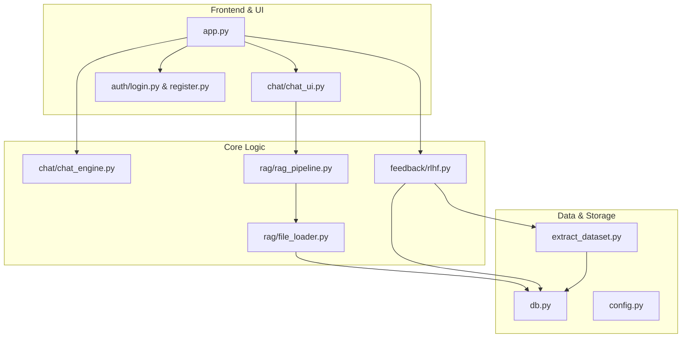

# 📘 Beginner's Guide: Building a Production RAG Chatbot

Welcome to the technical breakdown of the Production RAG Chatbot. This guide explains how we combine modern AI with robust engineering practices like observability and data persistence.

---

## 🌟 1. What is RAG? (The Big Picture)

Standard AI (like ChatGPT) knows a lot about the world but doesn't know about *your* private documents. **RAG (Retrieval-Augmented Generation)** solves this:

1.  **Retrieve**: When you ask a question, the system searches your uploaded files for relevant snippets.
2.  **Augment**: It "glues" those snippets to your question.
3.  **Generate**: It sends the combined text to the AI (Azure OpenAI) to get a factual answer based *only* on that context.

**Analogy**: It's like giving the AI an open-book exam using your PDF as the textbook.

---

## 🏗️ 2. The Tech Stack

| Component | Technology | Purpose |
| :--- | :--- | :--- |
| **Frontend** | Streamlit | Creates the chat interface and sidebar using simple Python. |
| **The Brain** | Azure OpenAI (GPT-4o) | Uses two models: "Normal" (low temperature) for facts and "Creative" (high temperature) for retries. |
| **Vector Memory** | ChromaDB | Stores your documents as "embeddings" (mathematical versions of text). |
| **Relational Memory**| SQLite | Stores user accounts and your chat history. |
| **The Auditor** | MLflow | Tracks performance, logs "traces" (AI thinking steps), and manages datasets. |

---

## 🚀 3. How the Data Flows

### A. Teaching the Bot (Ingestion)
When you upload a file in the sidebar (`chat/chat_ui.py`):
1.  The `rag/file_loader.py` reads the PDF, Word, or Image file.
2.  **Bonus: OCR**: If you upload an image (PNG/JPG), the system uses `pytesseract` to "read" the text inside the picture.
3.  The text is broken into small pieces (chunks).
4.  These chunks are saved in **ChromaDB**. Now the bot "knows" your data.

### B. Asking a Question (Inference)
When you type a message in `app.py`:
1.  **Check Context**: The system asks ChromaDB: "Do we have any text related to this question?"
2.  **The Decision**: 
    *   **If YES**: It sends the text to the AI with the instruction: "Answer ONLY using this context."
    *   **Grounding**: If the AI is unsure, it is trained to say `I_DO_NOT_KNOW_CONTEXT` rather than guessing.
    *   **If NO (Fallback)**: It falls back to General AI knowledge and tells you: "I didn't find this in the files."
3.  **Logging**: **MLflow** records the "Trace," including how long it took (latency) and exactly what the AI saw.

### C. The "Creative Retry" Loop
If you give a **Thumbs Down (👎)** to an answer:
1.  The system automatically deletes the bad answer.
2.  It switches to a **Creative LLM** (higher temperature).
3.  It asks the AI to provide a "completely alternative view" based on your feedback.
4.  This interaction is flagged in MLflow as a `retry_mode_active`.

---

## 🛠️ 4. Detailed File Architecture

The project is organized into modular layers. Here is how the files connect to each other:

### File-by-File Explanation
*   **`app.py`**: The entry point. It handles the main chat loop, manages user sessions, and coordinates between the RAG pipeline and the AI models.
*   **`db.py`**: The data gateway. It manages **ChromaDB** (for document search) and **SQLite** (for users and history).
*   **`chat/chat_ui.py`**: Controls the sidebar, file uploader, and session buttons (New Chat, Delete History).
*   **`chat/chat_engine.py`**: Configures the AI "Brains"—defining whether the AI should be strictly factual or more creative.
*   **`rag/file_loader.py`**: The multi-tool parser. It handles PDFs, Text, Word docs, and even uses OCR to read text from images.
*   **`rag/rag_pipeline.py`**: The logic that cuts documents into "chunks" and prepares them for the vector database.
*   **`feedback/rlhf.py`**: Captures human feedback (👍/👎) and sends it to MLflow for performance auditing.
*   **`extract_dataset.py`**: A utility script that exports all your interactions and feedback into a clean dataset for training or testing.
*   **`config.py`**: A central location for all your "secrets," such as Azure API keys and database file paths.

---

## 📈 5. Monitoring with MLflow (The "Black Box")

In a production app, we need to know why an AI failed. Every time you chat, a **Trace** is created. If you look inside `mlartifacts/`, you'll see `traces.json` files. These contain:

1.  **`spanInputs`**: What the user actually said.
2.  **`tokenUsage`**: How many words were processed (important for cost).
3.  **`latency_ms`**: How many milliseconds it took to respond.

This allows us to see the "thought process" of the AI.

### 💡 How to see Sessions and Prompts?
If you don't see your data in the MLflow UI (`http://localhost:5000`):
1.  **Runs Tab**: Look for the "Run Name" column (e.g., `Chat_user_14:30:05`). We've updated the code to name runs dynamically.
2.  **Nested Runs**: Click the `+` icon next to a `Session_` run to see all the individual `Prompt_` runs inside that session.
3.  **Table View**: Click on an individual Prompt run, go to **Artifacts**, and look for `chat_logs/interaction_table.json`. MLflow will render this as a beautiful, searchable table.
4.  **Parameters**: You can also click "Columns" in the MLflow UI to add `user_prompt` directly to your main dashboard view.
5.  **Traces Tab**: This is the best place to see the full "thought process" and how the RAG context was used.
6.  **Artifacts**: Check the `evals/` folder for JSON logs of each interaction.

---

## 🔐 6. Safety & Security

*   **Multi-User Isolation**: Your documents are stored with your `username`. Users cannot see each other's files.
*   **Content Filters**: If the AI tries to say something inappropriate, the Azure Content Filter (handled in `app.py`) will trigger a safe fallback message.

---

## 🎯 Summary for New Developers
1.  **User logs in** (`auth/`).
2.  **User uploads knowledge** (`rag/`).
3.  **User asks a question** (`app.py`).
4.  **System searches, answers, and logs** (`mlflow`).
5.  **User gives feedback**, creating a "Golden Dataset" for future improvements.

**Happy Coding! 🚀**
