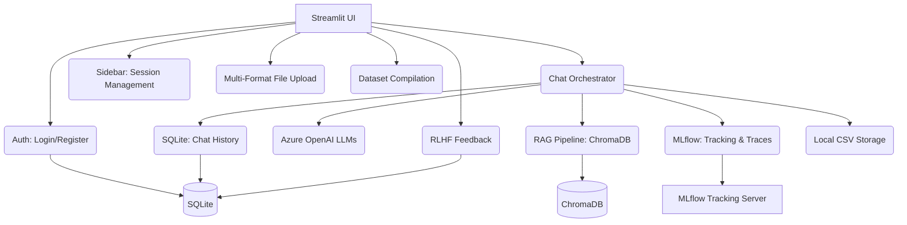

# Low-Level Design (LLD): Production RAG Chatbot Platform
## 1. Introduction
This document details the low-level design for the Production RAG Chatbot Platform. The system is a multi-user, secure RAG (Retrieval Augmented Generation) application built with Streamlit. It leverages Azure OpenAI for LLM capabilities, ChromaDB for vector storage, SQLite for relational data management, and MLflow for experiment tracking, tracing, and dataset versioning.

## 2. System Architecture
The platform follows a client-server model where Streamlit orchestrates interactions between the user, the RAG pipeline, and various persistence layers.

## 3. Component Breakdown

### 3.1. app.py (Main Orchestrator)
- **Responsibility**: Manages the Streamlit session, chat loop, and service integration.
- **Key Logic**: 
    - Implements the primary chat execution context.
    - Handles "Creative Retry" mode using an alternative LLM temperature.
    - Orchestrates MLflow run lifecycle and telemetry logging.
    - Manages fallback logic: attempts RAG retrieval first; if no context is found or a "I don't know" phrase is   detected, it falls back to general AI knowledge.

### 3.2. Authentication (auth/login.py & auth/register.py)
- **Responsibility**: Manages user access using SQLite.
- **Security**: Handles password verification and persists `display_name` updates.

### 3.3. chat/chat_engine.py
- **Responsibility**: Initializes `AzureChatOpenAI` instances.
- **Configurations**: Provides a "Normal" LLM for standard queries and a "Creative" LLM for retries.

### 3.4. chat/chat_ui.py
- **Responsibility**: Renders the sidebar and history navigation.
- **Features**:
    - Supports uploading PDF, TXT, DOCX, and Image (PNG/JPG) files.
    - Provides session control (New Chat, Clear, Delete History).
    - Triggers on-demand dataset extraction.

### 3.5. rag/file_loader.py
- **Responsibility**: Multi-format document ingestion.
- **Supported Formats**:
    - **PDF**: Uses `PyPDFLoader`.
    - **TXT**: Uses `TextLoader`.
    - **DOCX**: Uses `python-docx` for paragraph extraction.
    - **Images**: Employs `pytesseract` (OCR) to extract text from screenshots or scanned documents.

### 3.6. feedback/rlhf.py
- **Responsibility**: Captures human feedback (👍/👎).
- **Integrations**: 
    - Updates the active MLflow run with a `human_feedback_score`.
    - Logs feedback text directly into the MLflow Trace for fine-grained debugging.
    - Triggers immediate updates to the local CSV dataset.

### 3.7. extract_dataset.py
- **Responsibility**: Data persistence and evaluation set preparation.
- **Methods**:
    - `update_local_csv`: Real-time appending of interactions to a user-specific CSV.
    - `export_mlflow_feedback_dataset`: Aggregates all JSON artifacts from MLflow runs into a "Golden" evaluation dataset.

## 4. Data Flow
1.  **Ingestion**: User uploads files -> `file_loader.py` parses text -> `rag_pipeline.py` chunks and stores embeddings in ChromaDB.
2.  **Inference**:
    - User sends prompt -> MLflow run starts -> `chat_history` is retrieved from SQLite.
    - `retriever` queries ChromaDB.
    - LLM processes augmented prompt.
    - Response is displayed and logged to MLflow as an artifact.
3.  **Persistence**:
    - Interaction details are saved to a temporary JSON and uploaded to MLflow `evals/`.
    - The `datasets/*.csv` file is updated immediately.
    - The chat session is updated in the SQLite `chat_history` table.

## 5. Database Schema

### 5.1. SQLite (Users.db)
- **users**: `username` (PK), `password`, `display_name`.
- **chat_history**: `session_id` (PK), `username`, `title`, `messages_json`, `updated_at`.
- **feedback**: `feedback_id` (PK), `username`, `prompt`, `response`, `timestamp`.

### 5.2. ChromaDB
- **Collection**: `pdf_vectors` (persistent storage for document embeddings).

## 6. MLflow Integration
- **Tracking URI**: `http://127.0.0.1:5000`
- **Autologging**: `mlflow.langchain.autolog()` captures full trace visibility for every chain invocation.
- **User Tracking**: `mlflow.set_user()` ensures logs are categorized by the logged-in user.
- **Metrics**: Tracks `latency_ms`, `vector_tool_calls`, and `retrieval_success`.
- **Artifacts**: Stores per-interaction JSON files used for later evaluation dataset compilation.

## 7. Key Features
- **Multi-User isolation**: Users only see their own history and files.
- **Hybrid RAG**: Seamless fallback from document-based answers to general knowledge.
- **OCR Support**: Ability to "chat" with text inside images.
- **Observability**: Every decision the LLM makes is recorded in MLflow Traces.
- **RLHF Loop**: Integrated feedback mechanism to build custom datasets for future fine-tuning or evaluation.

## 8. Future Considerations
- **Scalability**: Migrate from SQLite to PostgreSQL for high-concurrency environments.
- **Advanced RAG**: Implement re-ranking (e.g., Cohere) to improve retrieval precision.
- **Streaming**: Enable token-by-token streaming in the Streamlit UI for better UX.
- **Security**: Upgrade to `bcrypt` for more secure password hashing.

<!--
[PROMPT_SUGGESTION]Can you update the SQLite implementation in db.py to include better error handling for concurrent writes?[/PROMPT_SUGGESTION]
[PROMPT_SUGGESTION]How can I integrate RAGAS metrics into the extract_dataset.py script to score the compiled datasets?[/PROMPT_SUGGESTION]
-->
